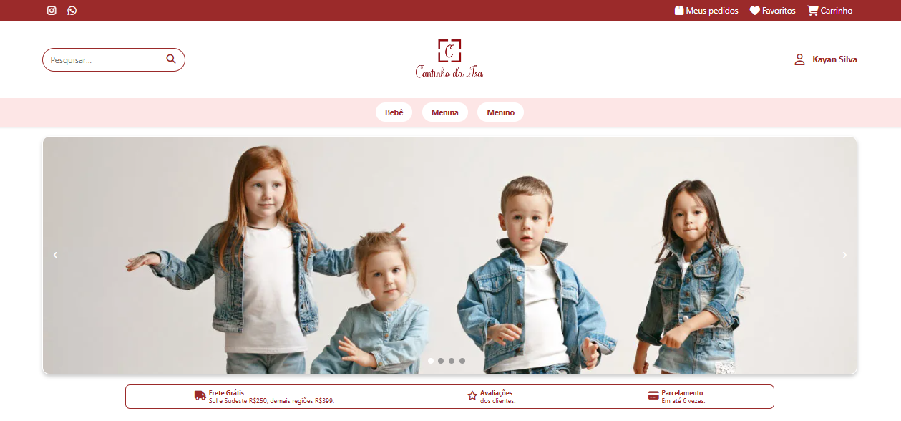
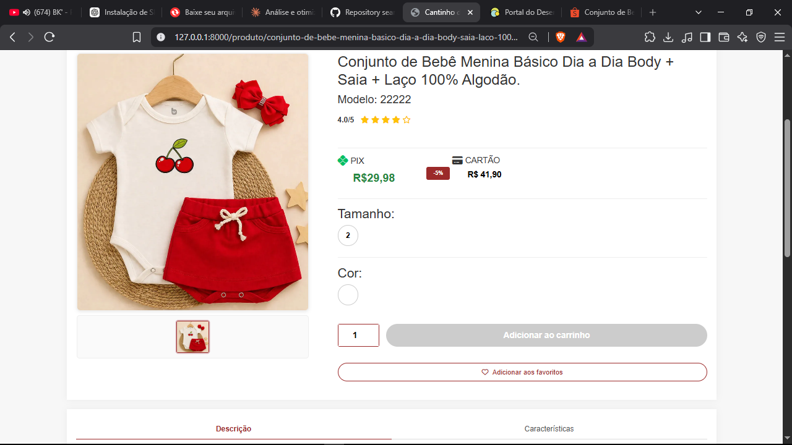
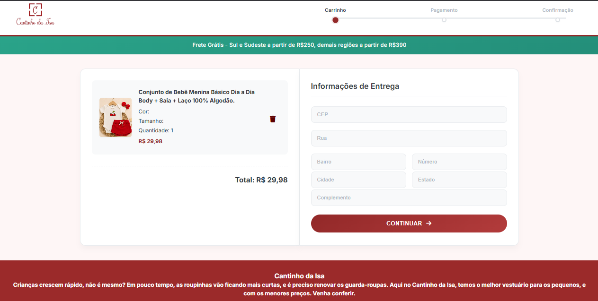
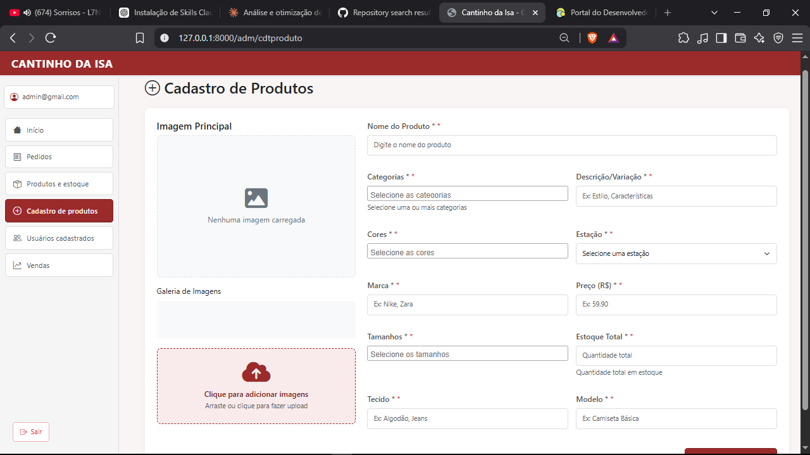
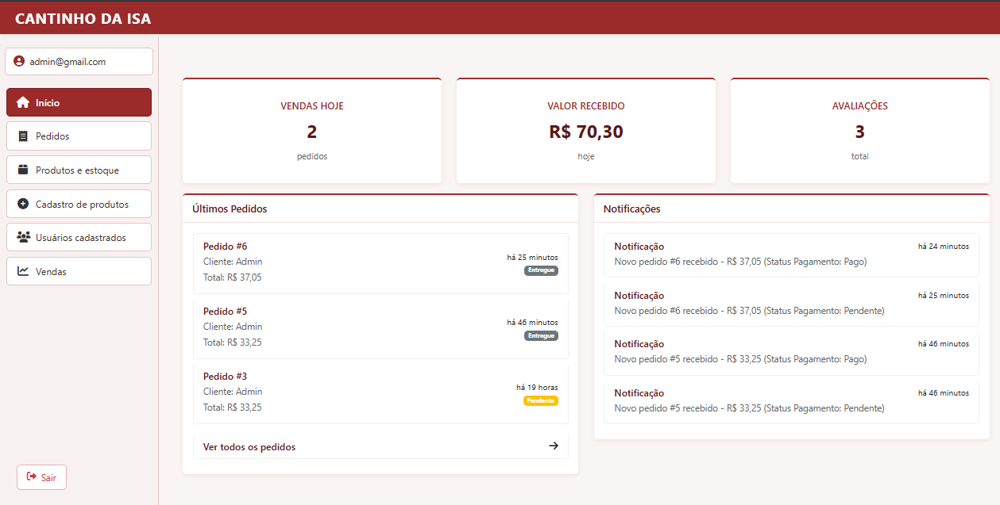
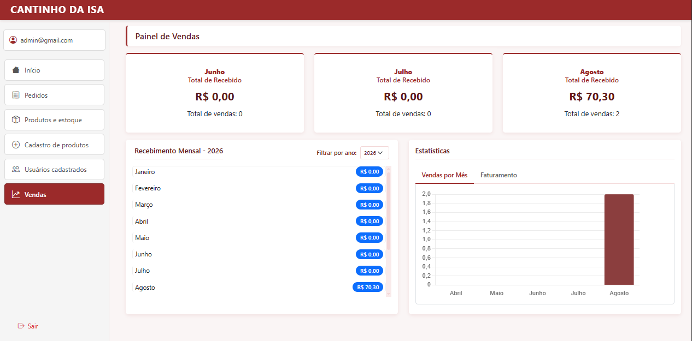

======================================================================
🇧🇷 VERSÃO EM PORTUGUÊS: E-COMMERCE DE ROUPAS INFANTIS – TCC
======================================================================
*(🇺🇸 English version: [README.md](./README.md))*

📌 SOBRE O PROJETO
----------------------------------------------------------------------
Este projeto consiste em um sistema de E-Commerce de Roupas Infantis
desenvolvido como Trabalho de Conclusão de Curso (TCC). O sistema
permite o gerenciamento completo de produtos, usuários e pedidos,
login social com Google, e processamento de pagamentos através da
integração com a API do PagSeguro em ambiente de desenvolvimento
(Sandbox).

O objetivo principal foi aplicar na prática conceitos de desenvolvimento
web, arquitetura MVC, modelagem de banco de dados, autenticação
(tradicional e OAuth) e integração com APIs de pagamento em um cenário
real de e-commerce.

📸 CAPTURAS DE TELA
----------------------------------------------------------------------
| Home | Página do produto |
|---|---|
|  |  |

| Carrinho / Checkout | Cadastro de produto (admin) |
|---|---|
|  |  |

| Painel administrativo | Painel de vendas |
|---|---|
|  |  |

🚀 FUNCIONALIDADES DO SISTEMA
----------------------------------------------------------------------
👥 FUNCIONALIDADES DO USUÁRIO:
- Cadastro e autenticação de usuários (e-mail/senha)
- Login social com Google (OAuth via Laravel Socialite)
- Verificação de e-mail
- Navegação e busca de produtos
- Gerenciamento de carrinho de compras
- Finalização de pedido
- Pagamento via PagSeguro (PIX, cartão, boleto)

🔧 FUNCIONALIDADES DO ADMINISTRADOR:
- Painel administrativo com estatísticas de vendas e últimos pedidos
- CRUD de produtos (Criar, Ler, Atualizar, Deletar)
- Upload de imagens dos produtos (convertidas automaticamente para WebP)
- Gerenciamento de pedidos
- Controle de usuários
- Painel de vendas com gráfico de faturamento mensal

🛠️ TECNOLOGIAS UTILIZADAS
----------------------------------------------------------------------
[BACKEND]
Tecnologia               | Finalidade
--------------------------|-------------------------------------------
PHP 8.1+                 | Linguagem de programação server-side
Laravel 10.x             | Framework MVC para estruturação da aplicação
MySQL                    | Sistema de gerenciamento de banco de dados
Laravel Breeze           | Estrutura base de autenticação
Laravel Socialite        | Login OAuth com Google
darryldecode/cart        | Gerenciamento do carrinho de compras

[FRONTEND]
Tecnologia               | Finalidade
--------------------------|-------------------------------------------
HTML5 / CSS3              | Estrutura e estilização das páginas
JavaScript                | Interatividade no cliente
Blade                     | Templates server-side

[FERRAMENTAS DE DESENVOLVIMENTO]
Ferramenta                | Finalidade
--------------------------|-------------------------------------------
Node.js & NPM              | Gerenciamento de dependências frontend
Composer                   | Gerenciamento de dependências PHP
Git & GitHub                | Controle de versão
Ngrok                       | Exposição do servidor local para webhooks
PagSeguro API (V4)          | Gateway de pagamento (Sandbox)
Brevo (SMTP)                | Envio de e-mails transacionais

🏗️ ARQUITETURA DO SISTEMA
----------------------------------------------------------------------
O sistema segue a arquitetura MVC (Model-View-Controller) do Laravel:

```
Navegador do Cliente
      │ Requisição HTTP
      ▼
Routes (web.php / auth.php)
      │
      ▼
Controller ──► Model (Eloquent / MySQL)
      │
      ▼
    View (Blade)
```

[ESTRUTURA DE DIRETÓRIOS]
```
app/
 |-- Http/Controllers/     # Lógica da aplicação
 |-- Http/Controllers/Auth # Login, cadastro, OAuth Google
 |-- Http/Middleware/      # Filtros de requisição
 |-- Models/               # Modelos de dados e relacionamentos
 |-- Services/             # Integrações externas (PagSeguro)
 |-- Support/              # Helpers compartilhados (URLs do PagSeguro)
routes/
 |-- web.php               # Rotas da aplicação web
 |-- auth.php              # Rotas de autenticação
resources/
 |-- views/                # Templates Blade
 |-- css/js/                # Assets frontend
database/
 |-- migrations/            # Controle de versão do schema
 |-- seeders/                # Dados de exemplo (categorias, tamanhos, cores)
```

🗄️ BANCO DE DADOS
----------------------------------------------------------------------
TABELAS PRINCIPAIS:
- `users`: Contas de clientes e administradores (inclui campos do Google OAuth)
- `produtos`: Catálogo de produtos
- `categorias`: Categorias dos produtos
- `pedidos`: Cabeçalhos dos pedidos
- `pedidos_itens`: Itens individuais por pedido
- `pagamentos`: Registros de transações de pagamento
- `reembolsos`: Registros de reembolso

DIAGRAMA DE RELACIONAMENTOS:
```
users (1) ------- (n) pedidos
pedidos (1) ------ (n) pedidos_itens
pedidos_itens (n) - (1) produtos
produtos (n) ---- (n) categorias
pedidos (1) ------ (1) pagamentos
```

💳 INTEGRAÇÃO COM PAGSEGURO
----------------------------------------------------------------------
O sistema integra com a **Orders API (V4)** do PagSeguro em modo
Sandbox, com geração automática de QR Code para pagamentos via PIX.

FLUXO DE PAGAMENTO:
```
Usuário → Sistema → PagSeguro Orders API → Webhook (via Ngrok) → Atualização do status do pedido
```

POR QUE USAR NGROK?
Como o PagSeguro precisa de uma URL pública para enviar notificações de
mudança de status (webhooks), o Ngrok é usado durante o desenvolvimento
local para expor o servidor Laravel (porta 8000) para a internet.

PROCESSO DE PAGAMENTO (PIX):
1. Usuário adiciona produtos ao carrinho e vai para o checkout.
2. Sistema cria uma ordem na API do PagSeguro e recebe um QR Code.
3. Usuário paga escaneando o QR Code (ambiente Sandbox).
4. PagSeguro envia uma notificação (webhook) para a URL pública do Ngrok.
5. Sistema valida a assinatura da notificação e atualiza o status do pedido.
6. Usuário e administradores são notificados da confirmação.

⚙️ INSTALAÇÃO E CONFIGURAÇÃO
----------------------------------------------------------------------
1. Clonar o repositório: `git clone [URL]`
2. Instalar dependências PHP: `composer install`
3. Instalar dependências frontend: `npm install`
4. Configurar ambiente: `cp .env.example .env && php artisan key:generate`
5. Preencher o `.env` (veja os comentários no `.env.example` — banco,
   SMTP, OAuth do Google, PagSeguro)
6. Executar migrations: `php artisan migrate`
7. (Opcional) Popular dados de exemplo: `php artisan db:seed`
8. Compilar assets: `npm run dev` (ou `npm run build`)
9. Iniciar o servidor: `php artisan serve`
10. Iniciar o Ngrok (só necessário para testar webhooks localmente):
    `ngrok http 8000`, e depois atualizar `WEBHOOK_URL` no `.env`

🧪 TESTANDO A APLICAÇÃO
----------------------------------------------------------------------
ACESSO ADMIN:
Defina `access_level = admin` em um usuário direto no banco de dados.

CARTÕES DE TESTE DO PAGSEGURO (SANDBOX):
- Visa: 4111111111111111
- Mastercard: 5555555555554444

📄 DOCUMENTAÇÃO ADICIONAL
----------------------------------------------------------------------
Parte da documentação em `/docs` foi elaborada antes da finalização
completa do sistema, então alguns detalhes de implementação podem
diferir levemente da versão atual do código. Trate-a como referência
de modelagem geral, não como especificação exata da versão final.

🎯 OBJETIVOS ACADÊMICOS
----------------------------------------------------------------------
- Desenvolvimento Web (construção de e-commerce completo)
- Laravel Framework (implementação MVC e boas práticas)
- Modelagem de Banco de Dados (schemas relacionais)
- Autenticação (tradicional + OAuth 2.0)
- Integração de APIs (consumo de gateway de pagamento)
- Lógica de E-commerce (carrinho, pedidos, fluxo de checkout)
- Controle de Versão (Git/GitHub)
- Documentação de Software (escrita técnica)

👨‍💻 AUTORES
----------------------------------------------------------------------
KAYAN DA SILVA JESUS;
ISABELLA MURAKAMI ROCHA;
RAÍSSA NASCIMENTO MORAES;
LEONARDO PEREIRA BRAGA;
LUCAS VINÍCIUS SANTOS ROCHA;

Instituição: Etec Jardim Ângela
Curso: Desenvolvimento de Sistemas

📌 OBSERVAÇÕES IMPORTANTES
----------------------------------------------------------------------
⚠️ APENAS PARA FINS ACADÊMICOS: Não recomendado para uso em produção
sem auditoria de segurança e infraestrutura adequada.

SEGURANÇA PARA PRODUÇÃO (checklist):
- Implementar HTTPS (SSL)
- Manter `APP_DEBUG=false`
- Proteção CSRF em formulários (já habilitada por padrão no Laravel)
- Validação de assinatura obrigatória nos webhooks do PagSeguro
- Variáveis de ambiente reais para todas as credenciais (nunca no código)
- Logging e monitoramento

📝 LICENÇA
----------------------------------------------------------------------
Este projeto é para fins educacionais. Todos os direitos reservados.

📊 STATUS DO PROJETO
----------------------------------------------------------------------
✅ Desenvolvimento: Em fase final de ajustes
✅ Autenticação (tradicional + Google): Completa
✅ Pagamentos PIX: Completo
⚠️ Pagamentos via cartão/boleto: Simulado (sem integração real ainda)
⚠️ Produção: Não recomendado sem revisão de segurança
======================================================================
